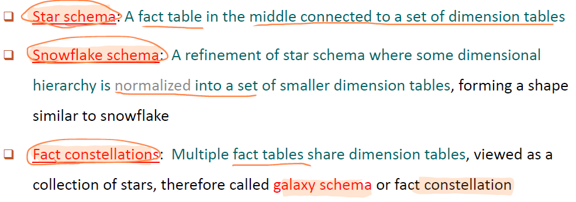
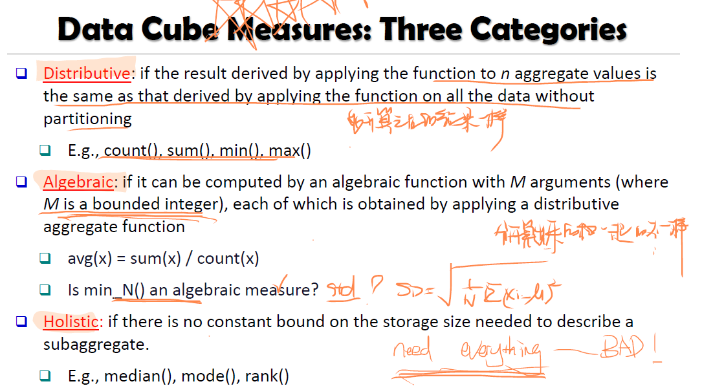

## Chap 4 Data Warehousing and On-line Analytical Processing

- Table
  - Dimension Table
  - Fact Table: contains measures
- Spreadsheet
- Data Cube ( P15-16)
  - Base Cuboid: n-D base cubes
  - Apex Cuboid: highest-level of summarization

#### 1. Data Warehouse: A multi-dimensional model of a data warehouse

##### 1) A Data Cube consists of dimensions & measures: (P15-16)

- Base Cuboid: n-D base cube

- Apex Cuboid: highest-level of summarization

  

##### 2) Star schema, snowflake schema, fact constellations (P17-20)

- Star Schema: 有一个中心的fact table连接着很多dimension tables
- Snowflake Schema： 连接的dimension tables有hierarchy
- Fact Constellation/ Galaxy Schema / Fact Constellation： 有多个fact table

##### 3) OLAP operations: drilling, rolling, slicing, dicing and pivoting 

- Roll Up/ Drill Up: summary并且降维
- Drill Down/ Roll Down： 增加维度
- Slice and Dice： slice 切片就是固定某个维度的值，dice是类似从多个维度挑选几个值
- Pivot / Rotate
- Drill Across
- Drill Through

##### 4） Measures: Distributive, Algebraic, Holistic

##### 2. Data Warehouse: Architecture, Design and Usage

##### 1) Multi-tiered architecture

##### 2) Business analysis design framework

##### 3）Information processing, analytical processing, data mining

##### 3. Implementation: Efficient computation of data cubes

##### 1) Partial Materialization vs. Full Materialization vs. No Materialization

##### 2) Indexing OALP data: Bitmap index and join index

##### 3) OLAP query processing

##### 4) OLAP servers: Relational OLAP( ROLAP), Multidimensional OLAP(MOLAP), Hybrid OLAP(HOLAP)

## Chap 5 Data Cube Technology

#### 1. Data Cube Computation: Preliminary Concepts

- Base Cell vs Aggregate Cell
- Ancestor Cell vs Descendant Cell
- Parent Cell vs Child Cell
- Full Cube vs Iceberg Cube
- **Close Cube & Close Cell**
- Cube Shell 

#### 2. Data Cube Computation Methods

- MultiWay Array Aggregation —— small number of dimensions

  

- BUC —— large number of dimensions

  

  

- High-Dimensional OLAP with Shell-Fragments

  

#### 3. Multidimensional Data Analysis in Cube Space

- Multi-feature Cubes
- Discover-Driven Exploration of Data Cubes

## Chap 6 Mining Frequent Patterns, Association and Correlations

#### 1. Basic Concepts

##### 1) Pattern Discovery

##### 2) Basic Concepts: Frequent Patterns and Association Rules

##### 3) Compressed Representation: Closed Patterns and Max-Patterns

#### 2. Efficient Pattern Mining Methods: 

##### 1) The Downward Closure Property of Frequent Patterns

##### 2) The Apriori Algorithm

##### 3) Extensions or Improvements of Apriori

##### 4) Mining Frequent Patterns by Exploring Vertical Data Format

##### 5) FP Growth A Frequent Pattern-Growth Approach

##### 6) Mining Closed Patterns

#### 3. Pattern Evaluation

##### 1) Interestingness Measures in Pattern Mining: Lift

##### 2) Interestingness Measures: Lift and X^2

##### 3) Null-Invariant Measures

##### 4) Comparison of Interestingness Measures

