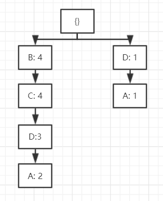

# CS412: Data Mining Homework 2

## Problem 1 

##### (a) 

2^10 = 1024

##### (b)

3

##### (c) 

(2 * 2^10 - 2) - 8 = 2038

##### (d) 

1

##### (e) 

8

## Problem 2 

##### (a) 

True: sum(x), sum(x^2) and count(x), which are distributive measures. average(x) use above distributive measures from each subset to get the result.

##### (b)

True: average(x) = 1/2[min(x) + max(x)]. min(x) and max(x) are distributive measures. average(x) use above distributive from each subset to get the result.

##### (c) 

True: max_50(x) and sum(x) are distributive measures. max_50(x) to get max 50 numbers from each subset.

##### (d) 

False: If the original dataset has 1000 numbers. Thus, we need to find out the largest number. While if we separate 1000 numbers into 10 groups and each contains 100 numbers. Then we will fail to use the formula to find the result from each subset and get the final result. 

##### (e) 

True: Since the data is guaranteed to be binary. We can get the count(0) and count(1) of each subset. Finally get the final count of the whole dataset. 0 or 1 which has more count will be the mode.

## Problem 3

##### (a) 

{B, C, D}

##### (b)

S = AB

##### (c) 

closed patterns: {D, AD, BC, BCD}

##### (d)  

max-patterns: {AD, BCD}

##### (e)
x ∈ {001, 002, ..., 005}, buys(x, B) ∧ buys(x, C) ⇒ buys(x, D).	 [0.8, 0.75]
x ∈ {001, 002, ..., 005}, buys(x, B) ∧ buys(x, D) ⇒ buys(x, C). 	[0.6, 1.0]
x ∈ {001, 002, ..., 005}, buys(x, C) ∧ buys(x, D) ⇒ buys(x, B). 	[0.6, 1.0]

##### (f) 

##### (g)

A	D:1, BCD:2

## Problem 4 

##### (a)

{B, C} {B, D} {C, D} {B, C, D}

##### (b) 
sum(S.price) >= 45: monotonic

sum(S.price) <= 45: anti-monotonic

We can use FP-Tree to mine frequent patterns with sum(S.price) <= 45

##### (c)

Both are convertible because can based on sorted value not sequence order.

avg(S.price) >= 30: use value descending order

avg(S.price) <= 30: use value ascending order