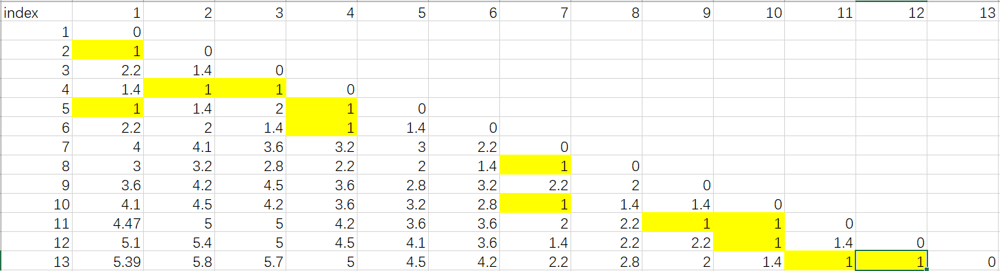

# Homework 5

## Problem 1 Naïve Bayes Classifier

##### (a) :

- i: 

  Pr(Popularity='P') = 7/10 = 0.7

- ii:

  Pr(Popularity='NP') = 3/10 = 0.3

- iii:

  Pr(Price="$", Delivery="Yes", Cuisine="Korean"|Popularity="P") = (3/7) * (5/7) * (2/7) = 0.087

- iv：

  Pr(Price="$", Delivery="Yes", Cuisine="Korean"|Popularity="NP") = (1/3) * (1/3) * (1/3) = 0.037

##### (b):

​	Pr(Popularity | Price="$", Delivery="Yes", Cuisine="Korean") = Pr(Price="$", Delivery="Yes", Cuisine="Korean"|Popularity) * Pr(Popularity) /  Pr(Price="$", Delivery="Yes", Cuisine="Korean") 

 - P: Pr(Popularity="P" | Price="$", Delivery="Yes", Cuisine="Korean") = Pr(Price="$", Delivery="Yes", Cuisine="Korean"|Popularity="P") * Pr(Popularity="P") /  Pr(Price="$", Delivery="Yes", Cuisine="Korean") 
 - NP: Pr(Popularity="NP" | Price="$", Delivery="Yes", Cuisine="Korean") = Pr(Price="$", Delivery="Yes", Cuisine="Korean"|Popularity="NP") * Pr(Popularity="NP") /  Pr(Price="$", Delivery="Yes", Cuisine="Korean") 

Since  Pr(Price="$", Delivery="Yes", Cuisine="Korean") is same. 

- P: 0.087*0.7
- NP: 0.037*0.3

Since Pr(Popularity="P") > Pr(Popularity="NP")

Thus, the restaurant classified as popular.

##### (c) 

​	Since we want to classify whether the restaurant is popular with several features. We can use Random Forest to improve the accuracy. 

- First, randomly choose subsets of feature to build up origin dataset.
- Second, use multi-thread and gini-index or other way to build up decision tree， which means recursively choose splitting condition value for each node in the tree.
- Then use majority voting to vote the class for each leaf in each decision tree.
- Last, use majority voting to vote multi decision tree and get the final classification.

##### (d) 

​	Use precision to evaluate the classification of the data.

 - Precision: TP/(TP+FP)

 - Recall: TP/(TP+FN)

 - F-1 Measure: 2TP/(2TP+FP+FN)

   Since the data is with rare positive examples, there will be a lot of FP based on this situation. While if we use recall, we calculate the accuracy of positive samples which can effectively evaluate the classification of data.

## Problem 2 KNN

##### (a) K = 1:

| Point   | True Label | Predict Label |
| ------- | ---------- | ------------- |
| 2.7 2.7 | +1         | -1            |
| 2.5 1   | +1         | +1            |
| 1.5 2.5 | -1         | -1            |
| 1.2 1   | -1         | -1            |

Test Error:  1/4 = 25%

##### (b) K=2:

| Point   | True Label | Predict Label 1 | Predict Label 2 |
| ------- | ---------- | --------------- | --------------- |
| 2.7 2.7 | +1         | -1              | -1              |
| 2.5 1   | +1         | +1              | +1              |
| 1.5 2.5 | -1         | -1              | -1              |
| 1.2 1   | -1         | -1              | -1              |

There are several ways to choose class if the each class has the same vote. In this question, if one point has same vote for -1 and +1, the final class will depends on the nearest neighbor. Thus, the test error is also 25%.

##### (c) Linear Classifier:

​	Since it doesn't need to be optimal. I choose

​	f(x) = x1- x2 + 0 as the linear classifier.

| Point   | True Label | Predict Label |
| ------- | ---------- | ------------- |
| 1 0.5   | +1         | +1            |
| 2 1.2   | +1         | +1            |
| 2.5 2   | +1         | +1            |
| 3 2     | +1         | +1            |
| 1.5 2   | -1         | -1            |
| 2.3 3   | -1         | -1            |
| 1.2 1.9 | -1         | -1            |
| 0.8 1   | -1         | -1            |

Training Error = 0

| Point | True Label | Predict Label     |
| ----- | ---------- | ----------------- |
| 1     | +1         | 2.7-2.7 = 0    +1 |
| 2     | +1         | 2.5-1=1.5      +1 |
| 3     | -1         | 1.5-2.5=-1    -1  |
| 4     | -1         | 1.2-1=0.2     +1  |

Test Error= 25%.

##### (d) 

​	Both KNN and linear classification method(SVM) works for this problem. While each of them also has drawbacks. 

- For KNN, K needed be settled down before training, while it's hard to find the best K for complicated dataset. What's more, for large dataset, calculating of KNN is expensive. 
- For SVM, outliers can play huge impact on the module and hard to find out outliers.

## Problem 3 Clustering

##### (a) K-Means

- First, calculate each point's distance to (0, 3) and (6, 4)

  | index  | 1        | 2        | 3        | 4        | 5        | 6        | 7       |
  | ------ | -------- | -------- | -------- | -------- | -------- | -------- | ------- |
  | (0, 3) | 1        | sqrt(2)  | sqrt(8)  | sqrt(5)  | 2        | sqrt(10) | 5       |
  | (6, 4) | sqrt(26) | sqrt(29) | 5        | sqrt(20) | sqrt(17) | sqrt(14) | sqrt(2) |
  | index  | 8        | 9        | 10       | 11       | 12       | 13       |         |
  | (0, 3) | 4        | sqrt(20) | sqrt(26) | sqrt(29) | sqrt(37) | sqrt(40) |         |
  | (6, 4) | sqrt(5)  | sqrt(5)  | 1        | sqrt(2)  | 0        | 1        |         |

- Second, cluster each point to the nearest cluster.

  | index | 1      | 2      | 3      | 4      | 5      | 6      | 7      |
  | ----- | ------ | ------ | ------ | ------ | ------ | ------ | ------ |
  |       | (0, 3) | (0, 3) | (0, 3) | (0, 3) | (0, 3) | (0, 3) | (6, 4) |
  | index | 8      | 9      | 10     | 11     | 12     | 13     |        |
  |       | (6, 4) | (6, 4) | (6, 4) | (6, 4) | (6, 4) | (6, 4) |        |

- Third, recalculate each cluster's center based on current points. 

  (11/6, 13/6), (5, 29/7)

- Repeat step two and three until every point stay in the same cluster.

- In this question, cluster 1: 1, 2, 3, 4, 5, 6; cluster 2: 7, 8, 9, 10, 11, 12, 13

##### (b) DBSCAN: MinPts = 2 Eps=1.5

- Arbitrarily select a point p, there I choose index 1.
- Then retrieve all points density-reachable from 1 w.r.t. Eps and MinPts. Using DFS can implement this part. Then get points 1, 2, 3, 4, 5, 6
- 1 is a core point, a cluster is formed
- Continue the process and choose index 7
- Then retrieve all points density-reachable from 7 w.r.t. Eps and MinPts. Using DFS can implement this part. Then get points 7, 8, 9, 10, 11, 12, 13
- 7 is a core point, a cluster is formed
- Stop when every point is clustered
- The result is same as above

##### (c) AGNES

- 

##### 

Choose smallest distance and cluster them together. {1, 2, 3, 4, 5, 6}, {7, 8, 9, 10, 11, 12, 13}

Then the higher hierarchy can combine them together. 